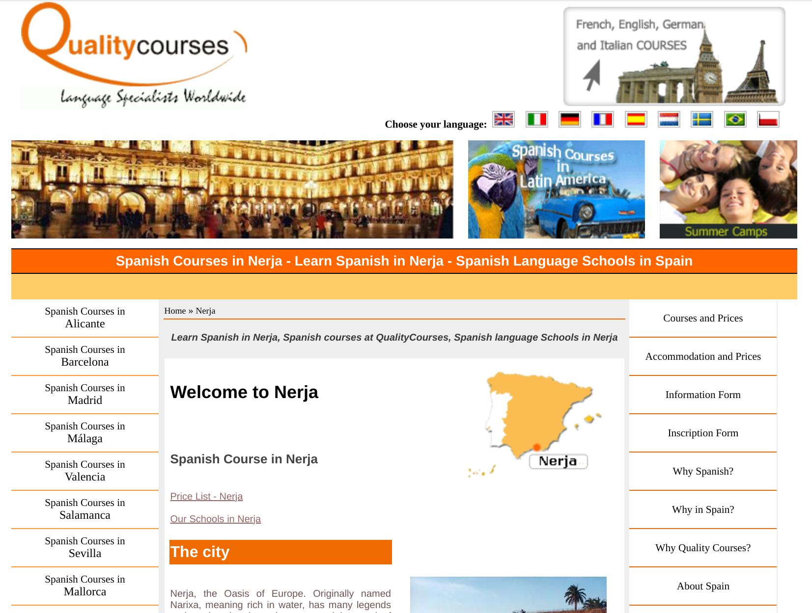

# QualityCourses - CMS Multilingüe

Proyecto CMS desarrollado en 2007 por Estrategias Móviles para QualityCourses, empresa dedicada a la comercialización de cursos de español en España.

## Contexto Histórico

Este proyecto representa un ejemplo auténtico del desarrollo web profesional en España a mediados de la década de 2000, antes del auge de los frameworks modernos de PHP (Laravel, Symfony) y antes de la consolidación de las mejores prácticas actuales de desarrollo de software.

## 🚀 Ejecutar el Proyecto

Para ver el proyecto funcionando tal como estaba en 2007, puedes usar el entorno Docker:

```bash
docker-compose up -d
```

Luego accede a http://localhost:8080/

**Instrucciones completas en [README.DOCKER.md](README.DOCKER.md)**

## Arquitectura Técnica

### Lenguajes y Tecnologías

- **Backend:** PHP 4/5 con funciones mysql_* (API mysql_connect, mysql_query, etc.)
- **Base de datos:** MySQL 5.0.27-community-nt
- **Motor de plantillas:** [TemplatePower](https://web.archive.org/web/20070623031812/http://templatepower.codocad.com/) (sistema de plantillas PHP)
- **Editor WYSIWYG:** [FCKEditor](https://web.archive.org/web/20070607154618/http://fckeditor.net/) (precursor de CKEditor)
- **Servidor web:** Apache con mod_rewrite para URLs amigables
- **Codificación:** ISO-8859-1 (característica de la época, UTF-8 era incipiente)

### Estructura del Sistema

```
pyQualityCourses/
├── README.md
├── imagenes/
├── _herramientas/
│   └── fckeditor/                  # Editor WYSIWYG
├── var/
│   └── www/
│       └── html/
│           ├── index.php           # Router principal (466 líneas)
│           ├── config.inc.php      # Configuración base
│           ├── _rutina.coneccion.php  # Conexión a BD
│           ├── _obtener.variables.php # Registro de variables globales
│           ├── plantilla_tp2.htm   # Plantilla principal
│           ├── curso-espanol-espana/  # Versión española
│           ├── coursdespagnolenespagne/  # Versión francesa
│           ├── corsodispagnoloinspagna/  # Versión italiana
│           ├── cursos-espanhol-espanha/  # Versión portuguesa
│           ├── spanischkurseinspanien/   # Versión alemana
│           ├── spaanse-cursussen-spanje/ # Versión holandesa
│           ├── spanskakurserspanien/     # Versión sueca
│           ├── kursyhiszpanskiegohiszpanii/  # Versión polaca
│           ├── image/               # Imágenes del sistema
│           ├── file/                # Documentos
│           ├── 2007-06-03-editor.Sitio2/  # Panel de administración
│           └── !-documentos.desarrollo/    # Documentación técnica
```

### Flujo de Ejecución del Sistema

1. **Ruteo (.htaccess):** Todas las peticiones se redirigen a index.php
2. **Identificación del recurso:** index.php determina si la petición corresponde a:
   - Página raíz de un país/idioma
   - Ciudad específica dentro de un país
   - Servicio (cursos, alojamiento, actividades)
   - Sección específica de un servicio en una ciudad
3. **Consulta a base de datos:** Recupera contenido según la jerarquía identificada
4. **Renderizado:** Utiliza TemplatePower para llenar la plantilla con el contenido dinámico

## Modelo de Datos

### Esquema de la Base de Datos (8 tablas)

| Tabla | Propósito | Campos Clave |
|-------|-----------|--------------|
| `mpais` | Configuración de países/idiomas | id, nombre, directorio, subdominio, icono, HTML personalizable |
| `mciudad` | Catálogo de ciudades disponibles | id, nombre, orden, visible |
| `mservicio` | Tipos de servicios | id, nombre, orden, visible |
| `mseccion` | Secciones de servicios | id, idservicio, nombre, orden |
| `tciudadpais` | Contenido por ciudad/país | idCiudad, idPais, nombreLocal, html_contenido, nombreHTML |
| `tserviciopais` | Contenido por servicio/país | idServicio, idPais, html_contenido, nombreHTML |
| `tseccionpais` | Contenido por sección/país | idSeccion, idServicio, idPais, html_contenido |
| `msitio` | Configuración global del sitio | HTML superiores, menú, inferior, metatags |

### Jerarquía de Contenido

```
Pais (8 versiones)
├── Ciudades (15 ciudades en España)
│   └── Servicios (15 tipos: cursos, alojamiento, actividades, etc.)
│       └── Secciones (subdivisiones de servicios)
└── Servicios (a nivel de país)
    └── Secciones
```

## Características del CMS

### Multilingüismo

- 8 versiones del sitio totalmente independientes
- Cada versión tiene su propio directorio
- Contenido diferenciado por idioma
- Navegación entre idiomas mediante banderas

### Gestión de Contenido

- Sistema CRUD completo en panel de administración
- Edición de contenido mediante FCKEditor
- Personalización de HTML en múltiples niveles:
  - HTML_superior1: Cabecera global
  - HTML_superior2: Cabecera por país
  - HTML_menu: Menú lateral
  - HTML_contenido: Contenido principal por página
  - HTML_inferior: Pie de página global
  - HTML_direccion: Información de contacto
  - HTML_pie: Pie de página por país

### SEO

- Meta tags configurables por página
- URLs amigables mediante mod_rewrite
- Titulación dinámica por página
- Keywords y description personalizables

## Análisis Técnico para Ingeniería de Software

### Fortalezas (en contexto de 2007)

1. **Arquitectura CMS bien estructurada**
   - Separación clara entre contenido y presentación
   - Uso de motor de plantillas (TemplatePower)
   - Sistema de ruteo con mod_rewrite - técnica avanzada para la época

2. **Flexibilidad del sistema**
   - Jerarquía de contenido extensible (Pais → Ciudad → Servicio → Sección)
   - HTML personalizable a múltiples niveles
   - Diseño multilingüe desde el inicio

3. **Funcionalidad completa**
   - Panel administrativo con CRUD
   - Edición WYSIWYG de contenido
   - Gestión independiente por idioma

4. **Consideración SEO**
   - Meta tags configurables por página
   - URLs semánticas
   - Optimización para motores de búsqueda

### Limitaciones por Época

1. **Tecnología obsoleta**
   - PHP con funciones mysql_* (deprecadas en PHP 5.5, eliminadas en PHP 7.0)
   - Variables globales automáticas (_GET, _POST → variables directas)
   - HTML 4.01 Transitional (HTML5 aún no existía)
   - FCKEditor (evolucionó a CKEditor 5)

2. **Codificación de caracteres**
   - ISO-8859-1 en lugar de UTF-8
   - Problemas de internacionalización con caracteres especiales

3. **Ausencia de patrones modernos**
   - Sin POO ni frameworks (Laravel no existía, Symfony era versión 1.x)
   - Sin ORM
   - Sin inyección de dependencias
   - Sin arquitectura MVC formal

### Patrones y Antipatrones

#### Patrones Implementados

1. **Front Controller Pattern:** index.php actúa como punto de entrada único
2. **Template Method Pattern:** Plantilla fija con contenido variable
3. **Data Access Object (rudimentario):** Rutinas de conexión a BD

#### Antipatrones Identificados

1. **God Object:** index.php con 466 líneas maneja ruteo, lógica de negocio y vista
2. **Magic Numbers:** Identificadores hardcodeados (if ($idServicio==1))
3. **Code Duplication:** Bloques de SQL repetidos
4. **Global State:** Variables globales sin encapsulación
5. **Mixing Concerns:** Lógica de base de datos, presentación y configuración mezcladas

## Estado Actual

### Compatibilidad

- **No compatible con PHP 7.0+** (eliminación de funciones mysql_*)
- **No compatible con MySQL 8.0+** (ciertas sintaxis obsoletas)
- **No compatible con navegadores modernos sin adaptación** (HTML 4.01, CSS de 2007)

### Migración Necesaria para Uso Moderno

1. Actualizar a PHP 8.x
2. Migrar a PDO o MySQLi con prepared statements
3. Convertir a UTF-8
4. Reemplazar FCKEditor por CKEditor 5 o similar
5. Implementar MVC o usar framework moderno
6. Sanitizar todas las entradas de usuario
7. Eliminar uso de eval()
8. Actualizar a HTML5 y CSS moderno
9. Implementar autenticación robusta
10. Containerizar con Docker

## Valor Educativo

Este proyecto sirve como caso de estudio para:

1. **Evolución histórica del desarrollo web**
   - Comparar prácticas de 2007 vs 2026
   - Entender la transición del web 1.0 al 2.0

2. **Refactorización de código legacy**
   - Ejercicio práctico de modernización
   - Aplicación de principios SOLID

3. **Análisis de seguridad**
   - Identificación de vulnerabilidades
   - Aplicación de OWASP Top 10

4. **Arquitectura de sistemas**
   - Evaluación de patrones de diseño
   - Crítica constructiva de sistemas reales

5. **Gestión del ciclo de vida**
   - Técnicas de mantenimiento
   - Documentación de sistemas heredados

## Contexto de la Época (2007)

### Ecosistema PHP en 2007

- PHP 4.4.9 / PHP 5.2.x (PHP 5.3 con namespaces aún no existía)
- WordPress versión 2.x (código procedural)
- CodeIgniter versión 1.x (framework incipiente)
- Symfony versión 1.0 (primera release)
- Laravel aún no existía (primera release 2011)

### Desarrollo web en 2007

- jQuery 1.2 (recién lanzado)
- AJAX en auge
- Web 2.0 como concepto emergente
- Smartphones incipientes (primer iPhone 2007)
- Responsive design aún no existía (introducido 2010)

## Referencias

- Sitio original (Wayback Machine): https://web.archive.org/web/20070701050123/http://www.quality-courses.com/spanish-course-nerja.htm
- Documento de base de datos: `var/www/html/!-documentos.desarrollo/_modelo.datos.sql`
- Configuración del router: `var/www/html/.htaccess`

## Licencia

Este repositorio es conservado con fines educativos como caso de estudio de ingeniería de software.
